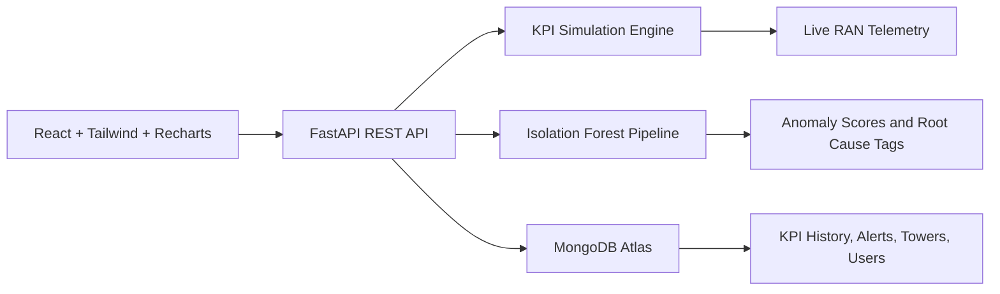

# Intelligent RAN Performance Analytics and Anomaly Detection Platform

An enterprise-style 5G RAN monitoring platform for live cell-site KPI tracking, anomaly detection, operational alerts, and network health visualization.

The interface follows telecom NOC dashboard patterns with a dark operations-focused layout, KPI panels, alerts, topology views, and performance charts.

## Architecture



## Features

- JWT login with Admin and Analyst demo roles
- Live 5G RAN tower monitoring with auto-refresh
- Simulated KPIs: RSRP, RSRQ, SINR, throughput, latency, packet loss, PRB utilization, handover success rate
- Anomaly detection using scikit-learn Isolation Forest
- Threshold breach alerts with telecom root-cause hypothesis tags
- Network health score and SLA compliance calculation
- Telecom topology map with healthy, warning, and critical towers
- Recharts visualizations for live KPI drift, health distribution, throughput comparison, and anomaly heatmap
- MongoDB Atlas persistence hooks for KPI history, alerts, anomalies, and tower metadata
- Deployment-ready structure for Vercel frontend and Render backend

## Tech Stack

Frontend:
- React
- Tailwind CSS
- Recharts
- Vite

Backend:
- FastAPI
- MongoDB Atlas through Motor
- scikit-learn
- pandas
- numpy
- JWT authentication

Deployment:
- Frontend: Vercel
- Backend: Render
- Local database inspection: MongoDB Compass

## Telecom Concepts Used

- RSRP: Reference Signal Received Power for coverage strength
- RSRQ: Reference Signal Received Quality for radio quality
- SINR: Signal-to-interference-plus-noise ratio for RF conditions
- PRB utilization: Physical Resource Block load and capacity pressure
- Handover success rate: mobility robustness indicator
- Packet loss and latency: user-plane and transport performance indicators
- SLA compliance: simplified operational quality target
- Root-cause hypotheses: RF interference, coverage hole, transport congestion, scheduler saturation, neighbor relation drift

## Screenshots

Add screenshots after running the app:

- Login screen
- RAN overview dashboard
- Simulated topology map
- KPI and anomaly charts
- Tower intelligence deep dive

## Project Structure

```text
backend/
  app/
    api/routes/          FastAPI route modules
    core/                configuration and security
    db/                  MongoDB connection
    ml/                  Isolation Forest anomaly detector
    models/              Pydantic schemas
    services/            KPI simulator and analytics services
    utils/               shared helpers
  scripts/               seed data generation
  requirements.txt
  render.yaml

frontend/
  src/
    api/                 REST client
    assets/              static assets placeholder
    components/          layout, chart, and topology components
    context/             authentication context
    pages/               login, dashboard, tower detail
    styles/              Tailwind and custom enterprise styling
    utils/               UI formatting helpers
  package.json
  tailwind.config.js
```

## Local Setup

### Backend

```bash
cd backend
python -m venv .venv
.venv\Scripts\activate
pip install -r requirements.txt
copy .env.example .env
uvicorn app.main:app --reload
```

The API runs at:

```text
http://127.0.0.1:8000
```

FastAPI documentation:

```text
http://127.0.0.1:8000/docs
```

### Frontend

```bash
cd frontend
npm install
copy .env.example .env
npm run dev
```

The frontend runs at:

```text
http://127.0.0.1:5173
```

Demo users:

```text
Admin: admin / admin123
Analyst: analyst / analyst123
```

## MongoDB Atlas and Compass

1. Create a MongoDB Atlas cluster.
2. Create a database user and allow your IP address.
3. Copy the Atlas connection string into `backend/.env` as `MONGODB_URI`.
4. Set `MONGODB_DATABASE=ran_analytics`.
5. Open the same connection string in MongoDB Compass to inspect collections.

Optional seed command:

```bash
cd backend
python scripts/generate_seed_data.py
```

Collections:

- `towers`
- `kpi_history`
- `alerts`
- `anomalies`
- `users` placeholder for extending dummy auth into database-backed auth

## API Endpoints

- `POST /login`
- `GET /dashboard`
- `GET /kpis`
- `GET /alerts`
- `GET /anomalies`
- `GET /network-health`
- `GET /tower`
- `GET /tower/{tower_id}`

Authenticated endpoints require:

```text
Authorization: Bearer <token>
```

## Anomaly Detection

The backend generates realistic KPI snapshots for multiple simulated 5G cell sites. The anomaly pipeline converts KPI records into a pandas DataFrame, standardizes numeric features, and runs an Isolation Forest model. Records predicted as outliers are mapped into severity levels and enriched with telecom root-cause hypotheses.

This keeps the system lightweight while still demonstrating a complete detection workflow:

- feature engineering from RAN KPI vectors
- unsupervised anomaly detection
- severity scoring
- review tags for operations teams
- threshold-based alerts alongside model-based anomalies

## Deployment

### Render Backend

1. Push the repository to GitHub.
2. Create a Render Web Service.
3. Set root directory to `backend`.
4. Build command: `pip install -r requirements.txt`
5. Start command: `uvicorn app.main:app --host 0.0.0.0 --port $PORT`
6. Add environment variables from `backend/.env.example`.

### Vercel Frontend

1. Import the repository in Vercel.
2. Set root directory to `frontend`.
3. Build command: `npm run build`
4. Output directory: `dist`
5. Add `VITE_API_BASE_URL` with the deployed Render API URL.

## Project Highlights

The project combines domain-specific RAN KPIs, anomaly detection, live operational visualization, alert triage, and deployment-ready full-stack engineering in a manageable architecture.
